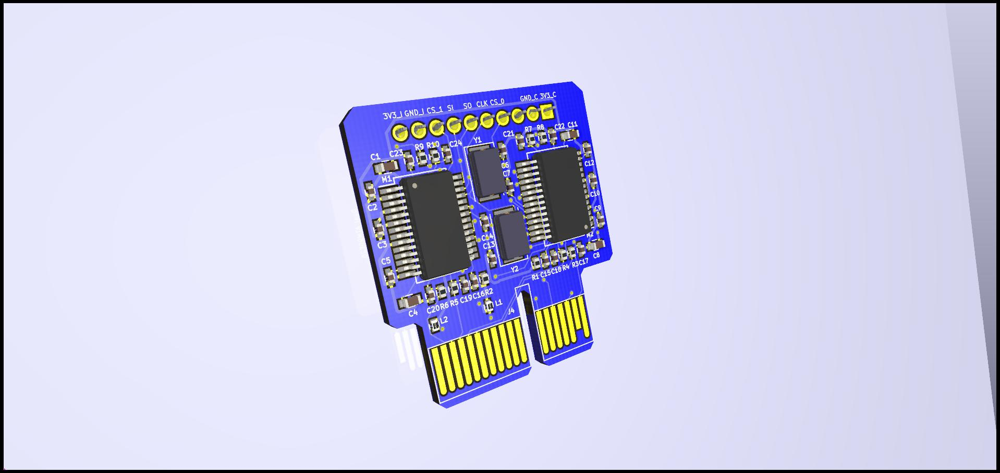
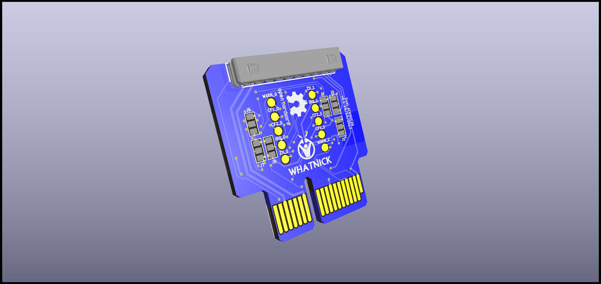

# DIN Rail / PCI-X1 compatible ATM90E26 Metering Module

This is a 2 unit DIN-Rail size in width ATM90E26 based metering module with a host of nice features, designed for use with the DIN-Rail energy monitor modules system.

## Features

- PCI-X1 lower connector for interface with power and analog voltage/current signals.
- x2 ATM90E26 energy monitor ASICs and associated crystals, RC filter networks.
- Molex SPI bus and power pass-through upper connector.
- Dense single-sided PCB with 0402 passives.
- Test points and jumpers on the bottom to allow additional uses.

## Renders

**DIN Meter ATM90E26 Front**

**DIN Meter ATM90E26 Back**
